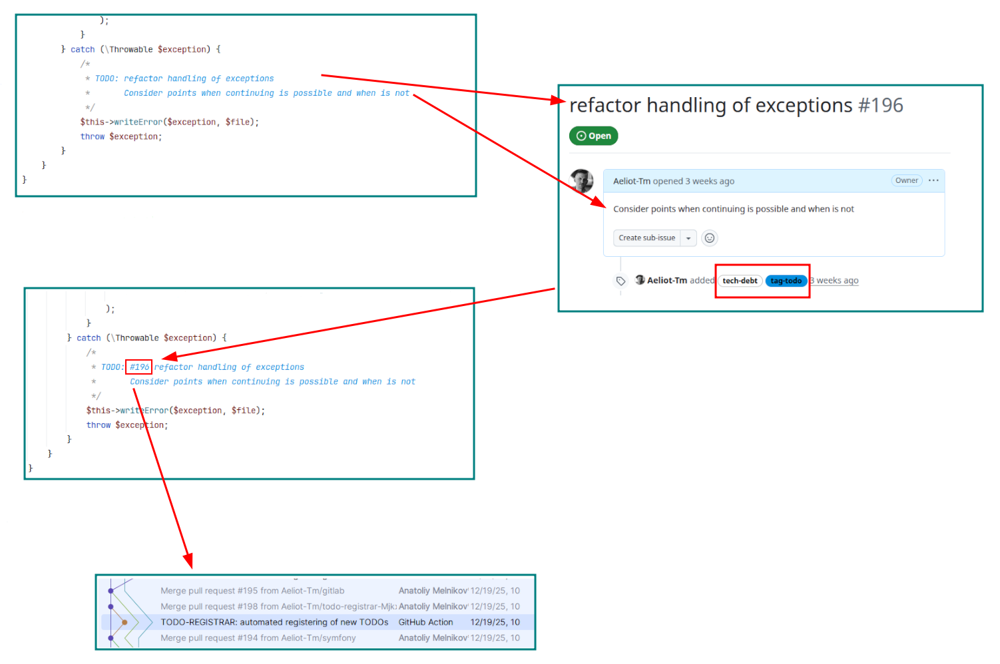
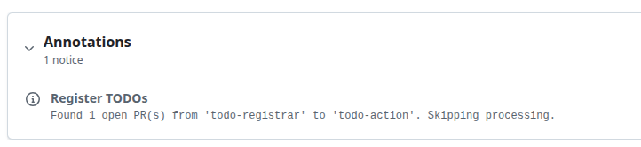

[](https://github.com/Aeliot-Tm/todo-registrar-action/releases)
[](https://github.com/Aeliot-Tm/todo-registrar-action/actions/workflows/automated-testing.yaml?query=branch%3Amain)
[](LICENSE)

# TODO Registrar Action

GitHub Action for finding TODO comments in code and automatically creating issues in your issue tracker.

This action runs the Docker container from **[TODO registrar](https://github.com/Aeliot-Tm/todo-registrar)**.

### Features

- Scans your codebase for TODO/FIXME/etc comments.
- Automatically creates issues in supported issue trackers (GitHub, GitLab, JIRA).
- Injects issue IDs back into TODO comments to prevent duplicates.
- Supports inline configuration for flexible issue customization.

The action adds issue numbers to TODO comments in the code and commits the changes. This helps avoid
duplicate tickets without an external database — everything is stored in your repository.



> See the latest **benchmark [here](https://github.com/Aeliot-Tm/todo-registrar-benchmark/blob/main/benchmark.md)**.

See [How it works](docs/how-it-works.md) for a step-by-step description of the action workflow, skip conditions, and when a pull request is created.

## Usage

Create a workflow file at `.github/workflows/todo-registrar.yaml` with the following contents:
```yaml
name: TODO registrar

on:
  push:
    branches: [ "main" ] # or "master" or "develop" (depends on your repository)

permissions:
  contents: write
  issues: write
  pull-requests: write

jobs:
  test:
    runs-on: ubuntu-latest
    steps:
      - uses: actions/checkout@v4
      - uses: Aeliot-Tm/todo-registrar-action@1.6.6
        with:
          new_branch_name: todo-registrar
```

## Inputs

| Input | Required | Default | Description |
|-------|----------|---------|-------------|
| `check_opened` | No | `true` | Check for open PRs: `true` (exact match), `like` (pattern match for templates), `false` (skip check) |
| `config` | No* | | Inline YAML configuration (recomeded) |
| `config_path` | No* | | Path to configuration file (relative to workspace) |
| `env_vars` | No | | Environment variable names to pass to container (newline or space separated) |
| `new_branch_name` | No** | | Branch name or template with placeholders. If empty, stays on the current branch |
| `target_branch_name` | No** | | Target branch for pull request. If empty, uses the current branch |
| `user_email` | No | `action@github.com` | Git user email for commits |
| `user_name` | No | `GitHub Action` | Git user name for commits |
| `verbosity` | No | `normal` | Verbosity level: `quiet`, `normal`, `verbose`, `very-verbose`, `debug` |

> \* If neither `config_path` nor `config` is provided, todo-registrar will check default configuration paths (see [configuration loading documentation](https://github.com/Aeliot-Tm/todo-registrar/blob/main/docs/config/general_config.md)).
>
> \** You can define flexible PR workflows using branch name templates.
> If both `new_branch_name` and `target_branch_name` are omitted or equal, no pull request is created,
> but changes are still pushed.

### The `new_branch_name` option

The `new_branch_name` option supports template placeholders that are replaced at runtime. All placeholders are **case-insensitive**.

| Placeholder | Description |
|-------------|-------------|
| `{current}` | Current branch name |
| `{runner_id}`, `{runnerId}` | GitHub workflow run ID (`github.run_id`) |
| `{random}` | Random alphanumeric string (5 characters by default) |
| `{random:N}` | Random alphanumeric string of N characters (e.g., `{random:10}`) |

**Template resolution examples:**

| Template | Resolved Branch Name |
|---|---|
| `{current}-todo-registrar-{random}` | `main-todo-registrar-a1b2c` |
| `{current}-{runner_id}-todo-registrar` | `main-12345678-todo-registrar` |
| `todo-registrar-{random:10}` | `todo-registrar-a1b2c3d4e5` |

> **Note:** The typo `{curent}` (single 'r') is also supported but will produce a warning.

### The `check_opened` option

The `check_opened` option helps avoid duplicate tickets. It is strongly recommended to enable it.

**Values:**

| Value | Description |
|-------|-------------|
| `true` | Exact match — checks for open PRs with the exact branch name |
| `like` | Pattern match — checks for open PRs matching the template pattern |
| `false` | Skip check — no PR checking is performed |

**Behavior:**

- **`true` (exact match)**: Checks for existing open PRs from `new_branch_name` to `target_branch_name`. Skips processing if found.
- **`like` (pattern match)**: Converts the `new_branch_name` template to a regex pattern and checks if any open PR's head branch matches. Useful when branch names contain dynamic parts like `{runner_id}` or `{random}`.
  - `{current}` → matches literal current branch name
  - `{runner_id}`, `{runnerId}` → matches any digits (`[0-9]+`)
  - `{random}`, `{random:N}` → matches alphanumeric characters (`[0-9a-z]+`)
- **Branch behind check** (for both `true` and `like`): If `new_branch_name` differs from current branch and exists on remote, checks if current HEAD is behind the remote branch. Skips processing if behind to avoid push conflicts.

> **NOTE:** When processing is skipped, the action still succeeds (does not fail) and adds a workflow annotation explaining why.
>
> 

## Outputs

| Output | Description |
|--------|-------------|
| `current_branch` | Current branch name |
| `has_changes` | Whether there were changes to commit (`true`/`false`) |
| `new_branch` | Resolved branch name after placeholder substitution |
| `skipped` | Whether processing was skipped (`true`/`false`) |
| `template_branch` | Original template before placeholder resolution |
| `target_branch` | Target branch for pull request |

See [Using outputs](docs/outputs.md) for practical examples: conditional steps, job outputs, and workflow summaries.

## Configuration

For a detailed description of configuration options, see the [TODO registrar documentation](https://github.com/Aeliot-Tm/todo-registrar/blob/main/docs/config/general_config_yaml.md).
Also see [how configuration files are loaded](https://github.com/Aeliot-Tm/todo-registrar/blob/main/docs/config/general_config.md).

## Examples

### With default configuration paths

If you have a configuration file at one of the default paths checked by todo-registrar (e.g., `.todo-registrar.yaml`, `.todo-registrar.yml`, etc.), you can omit both `config_path` and `config`:

```yaml
- uses: Aeliot-Tm/todo-registrar-action@1.6.6
  with:
    new_branch_name: todo-registrar
```

### With configuration file

```yaml
- uses: Aeliot-Tm/todo-registrar-action@1.6.6
  with:
    config_path: .todo-registrar.yaml
    new_branch_name: todo-registrar
```

### With inline configuration

```yaml
- uses: Aeliot-Tm/todo-registrar-action@1.6.6
  with:
    config: |
      paths:
        in: /code/src
      registrar:
        type: GitHub
        options:
          service:
            personalAccessToken: ${{ secrets.GITHUB_TOKEN }}
            repository: "${{ github.repository }}"
    new_branch_name: todo-registrar
```

### With environment variables

Use `env_vars` to securely pass environment variables (e.g., secrets) into the container.
Variables are defined in the standard `env` section and their names are listed in `env_vars`.
This works with both `config_path` and inline `config`:

**With config file:**

```yaml
- uses: Aeliot-Tm/todo-registrar-action@1.6.6
  env:
    GITHUB_TOKEN: ${{ secrets.GITHUB_TOKEN }}
    GITHUB_REPO: "${{ github.repository }}"
  with:
    config_path: .todo-registrar.yaml
    env_vars: |
      GITHUB_TOKEN
      GITHUB_REPO
    new_branch_name: todo-registrar
```

In your `.todo-registrar.yaml`, reference these variables using the `%env()%` syntax:

```yaml
registrar:
  type: GitHub
  options:
    service:
      personalAccessToken: '%env(GITHUB_TOKEN)%'
      repository: '%env(GITHUB_REPO)%'
```

**With inline config:**

```yaml
- uses: Aeliot-Tm/todo-registrar-action@1.6.6
  env:
    GITHUB_TOKEN: ${{ secrets.GITHUB_TOKEN }}
  with:
    env_vars: |
      GITHUB_TOKEN
      GITHUB_REPO
    config: |
      registrar:
        type: GitHub
        options:
          service:
            personalAccessToken: '%env(GITHUB_TOKEN)%'
            repository: '${{ github.repository }}'
    new_branch_name: todo-registrar
```

### With automatic branch and pull request

The action can automatically create a new branch, commit changes, push, and create a pull request:

```yaml
- uses: Aeliot-Tm/todo-registrar-action@1.6.6
  with:
    config_path: .todo-registrar.yaml
    new_branch_name: '{current}-todo-registrar-{runner_id}'
    check_opened: 'like'
```

This creates a branch like `main-todo-registrar-12345678` and uses pattern matching to detect any existing PR with a similar name pattern.

**Git workflow behavior:**

- If `new_branch_name` is not provided, changes are committed to the current branch
- If `target_branch_name` is not provided, it defaults to the current branch
- A pull request is created only when `new_branch_name` differs from `target_branch_name`
- If there are no changes to commit, push and PR creation are skipped

See [Pull request body and processing report](docs/pull-request-report.md) for PR title, summary metrics (Registered / New issues / Glued), and example descriptions.

**Custom Git user configuration:**

```yaml
- uses: Aeliot-Tm/todo-registrar-action@1.6.6
  with:
    config_path: .todo-registrar.yaml
    new_branch_name: todo-registrar
    user_name: 'My Bot'
    user_email: 'bot@example.com'
```

## Permissions

First, configure workflow permissions:
```yaml

permissions:
  contents: write         # required: allows committing and pushing
  pull-requests: write    # required: allows creating pull requests
  issues: write           # optional: allows creating issues on GitHub
```

Second, allow the action to create pull requests in the repository settings:
1. Go to your repository on GitHub
2. **Settings** → **Actions** → **General**
3. Scroll down to the "**Workflow permissions**" section
4. Check "**Allow GitHub Actions to create and approve pull requests**"
5. _Optional._ Select "**Read and write permissions**" to allow creating issues in the repository.
6. Click **Save**

### Triggering workflows for issues

By default, the action uses the standard runner token (`secrets.GITHUB_TOKEN`). However, events created
with this token (such as issue creation) **will not trigger other GitHub Actions workflows**.
This is a [GitHub limitation](https://docs.github.com/en/actions/security-for-github-actions/security-guides/automatic-token-authentication#using-the-github_token-in-a-workflow)
designed to prevent recursive workflow runs.

If you need issue-related workflows to be triggered automatically (e.g., labeling, notifications, project board automation),
you must use a separate personal access token (PAT) or a GitHub App token instead of the default one.

**Example with a separate token:**

```yaml
- uses: Aeliot-Tm/todo-registrar-action@1.6.6
  env:
    GITHUB_TOKEN: ${{ secrets.TODO_REGISTRAR_TOKEN }}
  with:
    config_path: .todo-registrar.yaml
    env_vars: GITHUB_TOKEN
    new_branch_name: todo-registrar
```
