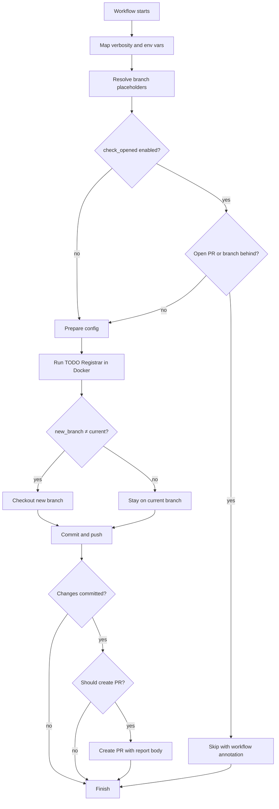

# How it works

TODO Registrar Action is a [composite action](https://docs.github.com/en/actions/creating-actions/creating-a-composite-action)
that wraps the [TODO Registrar](https://github.com/Aeliot-Tm/todo-registrar) Docker container and adds Git workflow automation:
branch handling, commits, push, and pull request creation.

## Overview

On each run, the action:

1. Prepares runtime options (verbosity, environment variables, branch names).
2. Optionally skips processing when a duplicate workflow would be redundant.
3. Scans the repository with TODO Registrar and updates TODO comments.
4. Commits and pushes changes when needed.
5. Opens a pull request with a summary built from the processing report.



## Step-by-step

### 1. Prepare runtime options

**Map verbosity to flag** converts the `verbosity` input into a TODO Registrar CLI flag (`-q`, `-v`, `-vv`, `-vvv`).

**Build environment flags** reads the `env_vars` input and builds Docker `-e` flags
so selected workflow environment variables are passed into the container.

### 2. Resolve branch names

**Determine branches for PR** resolves `new_branch_name` and `target_branch_name`:

- Placeholders such as `{current}`, `{runner_id}`, and `{random}` are substituted at runtime.
- If `new_branch_name` is empty, the current branch is used.
- If `target_branch_name` is empty, the current branch is used.
- A pull request is planned only when the resolved `new_branch` differs from `target_branch`.

Resolved values are exposed as outputs: `current_branch`, `template_branch`, `new_branch`, and `target_branch`.

### 3. Check whether to skip

When `check_opened` is `true` or `like`, **Check for open pull requests and branch status**
may set `skipped` to `true` and stop further steps.

Processing is skipped when:

| Condition | Mode | Result |
|-----------|------|--------|
| An open PR already exists from the working branch to the target branch | `check_opened: true` | Skip |
| An open PR head branch matches the `new_branch_name` template pattern | `check_opened: like` | Skip |
| The remote working branch is ahead of the current checkout | `true` or `like` | Skip |

When skipped, the action **still succeeds** and adds a workflow annotation explaining why.
See the [`check_opened` option](inputs.md#the-check_opened-option).

This step is omitted entirely when `check_opened: false`.

### 4. Prepare configuration

**Compose config path and flag** chooses how TODO Registrar receives its configuration:

- `config_path` → `--config=/code/<path>`
- inline `config` → `--config=STDIN`
- neither → todo-registrar uses its [default configuration paths](https://github.com/Aeliot-Tm/todo-registrar/blob/main/docs/config/general_config.md)

### 5. Run TODO Registrar

**Run TODO Registrar** starts the Docker container:

```text
ghcr.io/aeliot-tm/todo-registrar:4.1.0
```

The workspace is mounted at `/code`. The container:

- scans configured paths for TODO comments,
- creates or reuses issues in the configured tracker,
- writes issue keys back into source files,
- writes a JSON processing report to `${RUNNER_TEMP}/todo-registrar-report.json`.

### 6. Apply Git changes

If processing was not skipped:

1. **Checkout new branch** — creates and checks out the resolved branch when it differs from the current one.
2. **Commit and push changes** — stages all changes, commits with the message
   `TODO-REGISTRAR: automated registering of new TODOs`, and pushes to `origin`.
   - If there is nothing to commit, `has_changes` is set to `false` and push/PR steps are skipped.

### 7. Create a pull request

**Create pull request** runs only when all of the following are true:

- processing was not skipped,
- `new_branch` differs from `target_branch`,
- the commit step produced changes (`has_changes: true`).

The PR body is generated by [`scripts/build-pr-body.sh`](../scripts/build-pr-body.sh) from the JSON report.
See [Pull request body and processing report](pull-request-report.md) for layout, metrics, and examples.

## Common outcomes

| Outcome | `skipped` | `has_changes` | PR created |
|---------|-----------|-----------------|------------|
| Open PR already exists | `true` | `false` | No |
| Remote branch is ahead | `true` | `false` | No |
| No new TODOs to register | `false` | `false` | No |
| TODOs registered on current branch | `false` | `true` | No* |
| TODOs registered on a separate branch | `false` | `true` | Yes |

\* A pull request is created only when `new_branch_name` resolves to a branch different from `target_branch_name`.

## Related documentation

- [Examples](examples.md)
- [Inputs](inputs.md)
- [Using outputs](outputs.md)
- [Pull request body and processing report](pull-request-report.md)
- [Permissions](permissions.md)
- [Configuration](configuration.md)
- [TODO Registrar configuration](https://github.com/Aeliot-Tm/todo-registrar/blob/main/docs/config/general_config_yaml.md)
